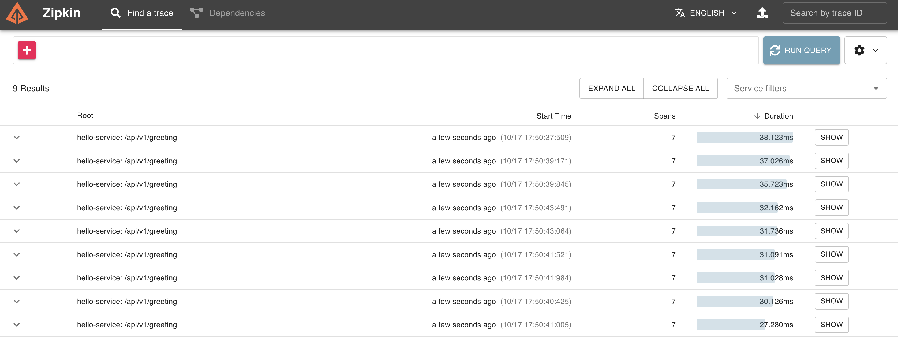
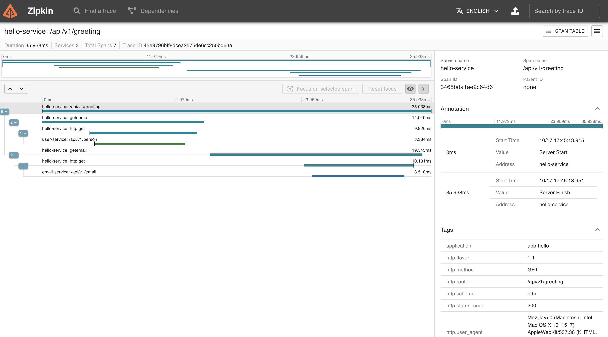
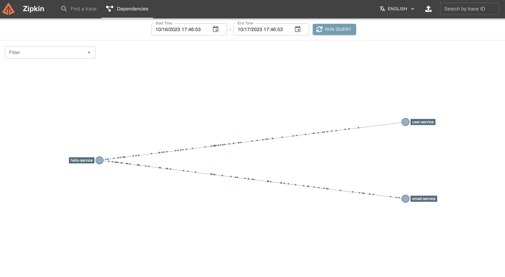
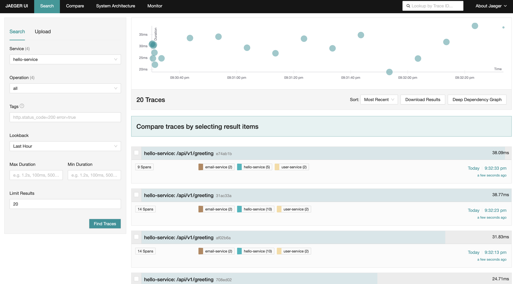
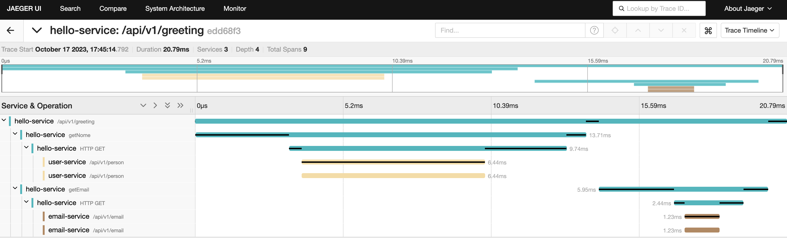

# Open Telemetry
Este repositório contém exemplos de configuração do Otel Collector para entrega de dados ao Zipkin e Jeager. Além de código exemplo de aplicações escritas em Golang.

## Pré Requisitos
Possuir as ferramentas abaixo:
- Docker
- Go 1.21

## Como executar?
Na raiz do projeto execute o comando abaixo:
```
 docker-compose up --build
```

## Gerando requisições
Para visualizar o tracing gerado pela aplicação é necessário gerar algumas requisições no endereço abaixo:
```
curl http://localhost:8080/api/v1/greeting
```

## Visualizando o tracing
### Zipkin
Acesse o browser no endereço abaixo
```
http://127.0.0.1:9411/
```
### Jeager
Acesse o browser com o endereço abaixo:
```
http://localhost:16686/
```

## Screenshots
### Zipkin




### Jeager


